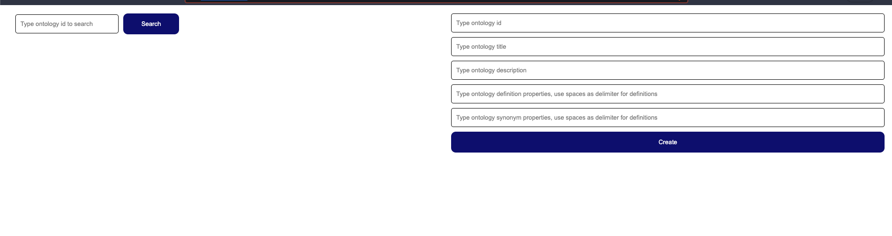

# Ontology tool demo
-------

### How to launch application
1. To start application run `docker-compose up -d`. 
2. Wait 20-30 sec until backend application start. 
3. Open webpage in the browser `http://localhost:8080/`. You should see the interface below

4. Feel free to search and create ontologies.

### How to launch test:
Tests (`src/test/java/com/example/ontology/tool/demo`) contain one integration test which runs the whole application context and makes endToEnd test.
Unfortunately, I didn't manage to set up running of Mongo DB test container(app had error `Connection refused` when test container is up).
To run all tests we have to have running Mongo DB, following instruction could help solve this issue.
1. Run command `cd ~/ontology-tool-deme/docker/dev` to move to the folder with MongoDb container configuration
2. Return to the root folder and run command `./mvnw '-Dtest=com.example.ontology.tool.demo.**' test` or use any other approach to run the test as you wish
